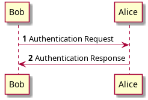

# PlantUML plugin for Inkdrop

[](https://github.com/jmerle/inkdrop-plantuml/actions?query=workflow%3ABuild)
[](https://my.inkdrop.app/plugins/plantuml)
[](https://my.inkdrop.app/plugins/plantuml)
[](https://github.com/jmerle/inkdrop-plantuml/blob/master/LICENSE)

This plugin makes it possible to add PlantUML diagrams to notes.

## Install

```
ipm install plantuml
```

## Usage

    ```plantuml
    @startuml
    autonumber
    Bob -> Alice : Authentication Request
    Bob <- Alice : Authentication Response
    @enduml
    ```

Will be rendered as:



The plugin has two modes, which can be configured in the plugin's settings:
- Local (default): diagrams are generated using the PlantUML jar provided by the plugin. Requires Java to be installed and available on your `PATH`. To be able to generate all diagram types [Graphviz](https://graphviz.org/) needs to be installed separately.
- Server: diagrams are generated using the PlantUML server located at the server url provided in the plugin's settings.

## Changelog

See the [GitHub releases](https://github.com/jmerle/inkdrop-plantuml/releases) for an overview of what changed in each update.

## Contributing

All contributions are welcome. Please read the [Contributing Guide](https://github.com/jmerle/inkdrop-plantuml/blob/master/CONTRIBUTING.md) first as it contains information regarding the tools used by the project and instructions on how to set up a development environment.
